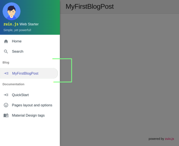

The only required knowledge to use this *web-starter*, is about basic use of the *Shell* and a simple text editor.
If you have already some experience in programming, of course, a better choice would be a *code editor* or *IDE*.


## Prerequisites

- [Install Node.js](https://nodejs.org/en/download/) version 12 or higher
- Install `zuix-cli`, command-line tool:  
```shell
npm install -g zuix-cli
```


## Creating a new project

To create a new web-starter project enter the following command:

```shell
zx new my-webapp
```

the new project structure will be created in the folder *my-webapp*.

Change directory to the new project folder:  

```shell
cd my-webapp
```

## Starting development server

The development server will listen by default on port `8080` and serve files from the build folder `./docs`.
It will also watch for file changes in the `./source` folder and build them as required, automatically refreshing the browser
page.

```shell
zx start
```

Once started you can open the web browser and load the website using the access URLs given in the console output.

```shell
[Browsersync] Access URLs:
 -----------------------------------
    Local: http://localhost:8080
 External: http://192.168.1.50:8080
 -----------------------------------
[Browsersync] Serving files from: docs
[Browsersync] Watching files...
```

The main project folder is the `./source` folder, where all website source files are located. In particular, the
`./source/pages` folder, contains all website pages that are implemented as text files that use [**Markdown**](https://www.markdownguide.org/getting-started/) syntax,
and that will contain just the main content of the page. All other structural and layout parts of the page will be compiled
automatically by the development server.


## Managing content

Included with this web starter you will also find these documentation pages that can be removed by *deleting* the
`./source/pages/docs` folder. This can be done also using the `zx` CLI:

```shell
zx wipe-docs
```

The documentation is anyway available online on this web-starter [demo site](https://zuixjs.github.io/zuix-web-starter/).


### Adding a new page

Pages are organized into sections. For example these documentation pages, are grouped under the "Documentation" section,
as shown on the left side drawer.


Sections and pages can be easily added with the following command:

```shell
zx add -s <section_name> -n <page_name> -fm "<field>: <value>"
```

Where the `-s` option is used to specify the name of the section under with the new page will be grouped, while the `-n`
option is used to specify the name of the page.
Both name must be *file-name* friendly, the [kebab-case](https://en.wikipedia.org/wiki/Letter_case#Kebab_case)
convention is adopted here.
Optionally it's also possible to specify [front matter data](../pages-layout) using the `-fm` option.

For example, the following code will add a new page in a section called "blog":

```shell
zx add -s blog -n my-first-blog-post -fm "options: mdl highlight"
```



The new page file will be `./source/pages/blog/my-first-blog-post/index.md`, and the `blog` folder will be automatically created
if it doesn't exist. The `blog` folder will also have an `index.liquid` file that just contains front matter data of the section,
and that can be used to customize the title and the display order in the homepage.


## Components

This web-starter is a component based web application that takes advantages of [zuix.js](https://zuixjs.org) library, a very versatile and 
fast library to create components.

The following components are used:
- **Side Drawer** with adaptive layout, that works both on mobile and desktop devices, supporting touch gestures
- **Auto-hiding header**, to allow a full immersive experience while reading pages on small screens
- **Menu overlay**, that can be used to quickly navigate within a page content, and that auto hides when the page is scrolled
- **Scroll helper**, used in some of the above components to handle page scroll events, and that can eventually  
be used to "watch" elements position and trigger events as they become visible on screen
- **Gesture detector**
- **Material Design** buttons, menu and cards, that can be also rendered using [liquid tags](../material-design-tags)

All the above components are part of [zKit](https://zuixjs.github.io/zkit/) library, a library of components built with *zuix.js*.  
To learn more about how to create and load components, see [zuix.js](https://zuixjs.org) website.


## Files structure in brief

Template engine folders:
```
./source/_data     # data folder
./source/_filters  # filters
./source/_inc      # includes and layouts
```

*zuix.js* components folders:
```
./source/app  # user-defined components
./source/lib  # copy of zKit components
```

Asset files and folders:
```
./source/images
./source/js
./browserconfig.xml
./favico.ico
./humans.txt
./manifest.json
```

Site search index and SEO:
```
./source/search-index.json.njk  # search-index builder script
./source/robots.njk
./source/sitemap.njk            # sitemap generator script
```

Main pages:
```
./source/home.liquid   # home page
./source/index.liquid  # landing page
```

Content pages:
```
./source/pages
```


## Compiling for production

```shell
NODE_ENV=production zx build
```

// TODO: about `./config/default.json` / `./config/production.json` and `baseUrl` etc...

